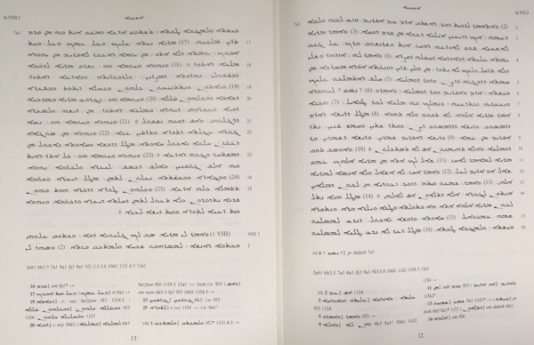

Peshitta
========

The Peshitta is the Syriac Old Testament.
See [Wikipedia](https://en.wikipedia.org/wiki/Peshitta).

Peshitta in Text-Fabric
--------------------------------------

This repo is a research environment for the study of the Peshitta.
You can run your own programs off-line, and publish your work in online notebooks.
To that end, the plain text of the Peshitta has brought into the Text-Fabric format,
which lends itself for easy data processing.

Corpus
------

This repo contains the transcription of the Peshitta in ETCBC/WIT format.
From there it has been converted to a Unicode plain text and a Text-Fabric
data set.

See also [about](docs/about.md).

Software
--------

The main processing tool is [Text-Fabric](docs/textfabric.md). It is instrumental to
turn the analysis of ancient data into computing narratives.

The ecosystem is Python and Jupyter notebooks.

Getting started
===============

Start with the
[tutorial](http://nbviewer.jupyter.org/github/etcbc/peshitta/blob/master/tutorial/start.ipynb).

Authors
=======

This repo is joint work of

*   [Hannes Vlaardingerbroek](https://leidenuniv.academia.edu/hvlaardingerbroek)
*   [Dirk Roorda](https://www.linkedin.com/in/dirkroorda/)

**N.B.:** Releases of this repo have been archived at [Zenodo](https://zenodo.org).
Click the DOI badge to be taken to the archive. There you find ways to cite this work.

Status
------

This is **work in progress!**

*   2018-10-16 Peshitta as a full-blown Text-Fabric [app](https://dans-labs.github.io/text-fabric/Api/Apps/).
    Archived at Zenodo.
