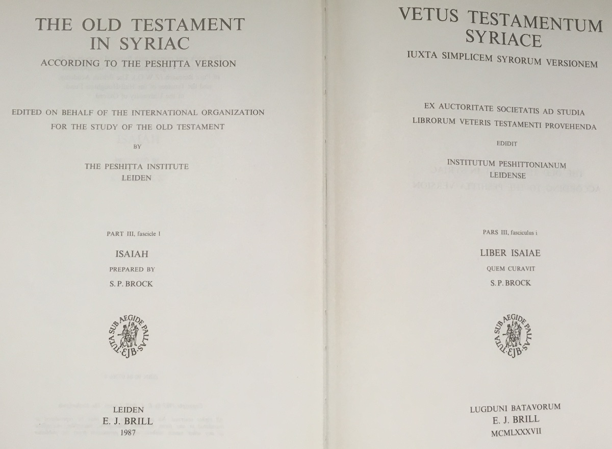
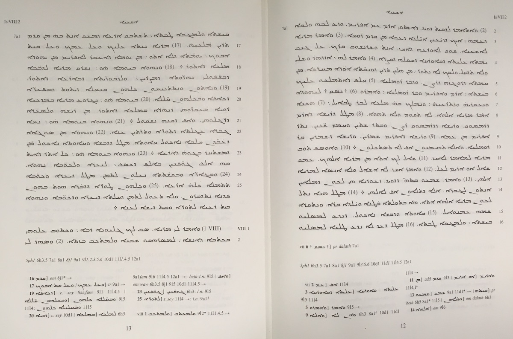

Peshitta
==============================

This repo is a research environment for the study of the (Old Testament)
[Peshitta](https://en.wikipedia.org/wiki/Peshitta).

You can run your own programs off-line, and publish your work in online notebooks.
To that end, the plain text of the Peshitta has brought into
[Text-Fabric](https://annotation.github.io/text-fabric/tf/about/fileformats.html)
format, which is a good starting point for textual data processing.

*Researchers who want to do philological or text-historical study on the Peshitta OT
should consult the critical apparatus in the printed edition (not in this repository).
An electronic edition of the Peshitta including its full critical apparatus
has been prepared by the Eep Talstra for Bible and Computer
([ETCBC](http://www.etcbc.nl/)) and has been published in the
[Brill Peshitta Online](https://brill.com/view/db/peso).*

Editors
=======

The general editors of the Peshitta Project are
[Bas ter Haar Romeny](https://research.vu.nl/en/persons/rb-ter-haar-romeny)
and
[Wido van Peursen](https://research.vu.nl/en/persons/wido-van-peursen).

The electronic text in this repo has been prepared by at the
[ETCBC](http://etcbc.nl)
by
Constantijn Sikkel,
[Geert Jan Veldman](https://research.vu.nl/en/persons/geert-jan-veldman)
and
[Wido van Peursen](https://research.vu.nl/en/persons/wido-van-peursen).

Corpus
======

The [source](https://github.com/ETCBC/peshitta/tree/master/source)
directory in this repo contains transcription files in the ETCBC/WIT format.

These files have been converted into Text-Fabric format,
We have a [specification](transcription.md) of the transcription format and
how we model the text in Text-Fabric.
The conversion result is available
in the [tf](https://github.com/ETCBC/peshitta/tree/master/tf) directory.

It is possible that the conversion program and the sources
undergo modifications.
This will lead to never versions of the data in the *tf* 
directory.

License and citation
=====================

The plain text of the Peshitta, its conversion to Text-Fabric format,
is subject to the
[CC-BY-NC license](https://creativecommons.org/licenses/by-nc/4.0/)

That means that you may use this data as you whish if you doi not use it commerically.

However, we would appreciate proper citation when you publish
results obtained by using this data.

You can cite this repository by mentioning the following information:

```
Wido Th. van Peursen, Geert Jan Veldman, Constantijn Sikkel, Hannes Vlaardingerbroek en Dirk Roorda.
(2018-10-17).
ETCBC/peshitta: (Version 0.3). Zenodo. http://doi.org/10.5281/zenodo.1464757
```

If you would like to use the textual data commercially, contact the ETCBC or Brill.

The conversion program itself it subject the liberal [MIT license](https://mit-license.org).

**N.B.:** Releases of this repo have been archived at [Zenodo](https://zenodo.org),
which ensures that you can use DOIs to point to specific versions.
These DOIs remain valid indefinitely.

Provenance
===========

The Electronic OT Peshitta Text provides an electronic version of the
[Vetus Testamentum Syriace (VTS)](https://brill.com/view/serial/PES),
prepared by the Peshitta Institute Amsterdam and published by Brill Publishers.
For those books that have already appeared in VTS,
the main text of the edition is given as the electronic text.
For the remaining books, the text of the
[Codex Ambrosianus](http://syri.ac/bibliography/1176620468)
is used.
This codex is the main source for the VTS edition
for this manuscript
(see also A.M. Ceriani’s
[facsimile](https://archive.org/details/CerianiTranslatioSyraPescittoVeterisTestamentiExCodiceAmbrosiano/page/n0)
edition).

For more information on the textual basis of the edition and the
electronic Peshitta text,
see the
[Introduction to the Electronic Peshitta Text](https://www.academia.edu/12601080/Introduction_to_the_Electronic_Peshitta_Text)
by Wido van Peursen.

The electronic text in the
[source](https://github.com/ETCBC/peshitta/tree/master/source)
directory has been obtained by OCR from the printed edition:

**The Old Testament in Syriac - according to the Peshitta version** by
*The Peshitta Institute Leiden*, published by E.J. Brill, 1987.



The OCR program used is
[syrocr](https://github.com/ETCBC/syrocr);
it has been written for this purpose by
[Hannes Vlaardingerbroek](https://leidenuniv.academia.edu/hvlaardingerbroek).



The printed edition contains a critical apparatus.
That is copyrighted by Brill and not included in this repo.

The program to convert the sources into text-fabric has been written by
[Dirk Roorda](https://www.linkedin.com/in/dirkroorda/).

